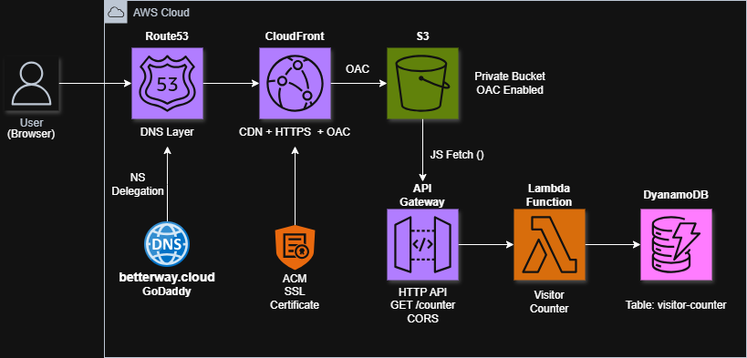

#  Cloud Resume Challenge — AWS 

## 📌 Overview
This project demonstrates a **real-world cloud architecture** by building and deploying a personal resume website using AWS services.

It follows a **secure, scalable, and serverless design**, integrating frontend hosting, backend APIs, and infrastructure best practices.

Designed and automated a serverless cloud architecture using **Terraform, integrating CloudFront (OAC-secured S3), API Gateway, Lambda, and DynamoDB, with dynamic frontend-backend integration, CI/CD automation using GitHub Actions, and custom domain via Route 53.**

---

## 🧱 Architecture Diagram



### 🔥 Architecture Flow

```
User (Browser)
↓
Route 53 (DNS)
↓
CloudFront (CDN + HTTPS)
↓
S3 Bucket (Private - OAC Enabled)
↓
Frontend (HTML, CSS, JS)
↓
API Gateway
↓
Lambda Function
↓
DynamoDB (Visitor Counter)
```
---

## Reusme Website


---

## ⚙️ Tech Stack

| Layer        | Services Used |
|-------------|--------------|
| Frontend     | HTML, CSS, JavaScript |
| Hosting      | Amazon S3 (Private) |
| CDN          | Amazon CloudFront (OAC) |
| Backend API  | API Gateway |
| Compute      | AWS Lambda |
| Database     | DynamoDB |
| DNS          | Route 53 |
| Domain       | GoDaddy (`betterway.cloud`) |

---
## 📁 Project Structure

```text
cloud-resume-challenge/
│
├── assets/
│   ├── Cloud-Resume-Challenge.png
│   └── Resume.png
│
├── backend/
│   ├── API Gateway/
│   │   └── README.md 
│   ├── DynamoDB/
│   │   └── README.md 
│   └── lambda/
│       ├── function.zip
│       ├── lambda_function.py
│       └── README.md 
│
├── cloudfront/
│   └── README.md 
│
├── Route53/
│   └── README.md 
│
├── frontend/
│   ├── css/
│   ├── img/
│   ├── js/
│   ├── vendor/
│   ├── index.html
│   └── README.md 
│
├── Terraform/
│   ├── main.tf
│   ├── output.tf
│   ├── variables.tf
│   ├── provider.tf
│   └── policy.json
│
├── README.md 
└── .gitignore
---

## 📚 Project Documentation

### 🔹 Frontend
- [Frontend Setup](./frontend/README.md)

### 🔹 Backend
- [API Gateway](./backend/API%20Gateway/README.md)
- [Lambda Function](./backend/Lambda/README.md)
- [DynamoDB](./backend/DynamoDB/README.md)

### 🔹 Infrastructure
- [CloudFront + OAC](./cloudfront/README.md)
- [Route 53 Custom Domain](./Route53/README.md)

---

## 🔐 Security Best Practices Implemented

- S3 bucket is **private (no public access)**
- Access controlled using **CloudFront Origin Access Control (OAC)**
- HTTPS enabled using **ACM SSL certificate**
- IAM roles follow **least privilege principle**

---

## 🚀 Deployment Flow (Step-by-Step)

1. Build frontend (HTML, CSS, JS)
2. Upload to S3 bucket (initial public testing)
3. Configure CloudFront (CDN + HTTPS)
4. Secure S3 using OAC (make private)
5. Create DynamoDB table (visitor counter)
6. Build Lambda function (update counter)
7. Expose API via API Gateway
8. Connect frontend → API
9. Configure Route 53 with custom domain

---

## ⚡ Key Features

- Fully serverless architecture
- Global content delivery using CloudFront
- Secure private S3 access (OAC)
- Dynamic visitor counter using Lambda + DynamoDB
- Custom domain with HTTPS

---

## ⚙️ Infrastructure as Code — Terraform

### Overview
The entire Cloud Resume Challenge infrastructure was provisioned using **Terraform**, enabling a repeatable, automated, and production-ready deployment.

Terraform was used to create and manage:
- S3 (private bucket with OAC)
- CloudFront distribution
- API Gateway
- Lambda function
- DynamoDB table
- IAM roles and policies

---

## ⚡ Key Terraform Concepts 

- Resource creation and management  
- `variables.tf` and `terraform.tfvars` usage  
- `outputs.tf` for exposing values  
- `templatefile()` for dynamic policies (e.g., S3 bucket policy)  
- `filebase64sha256()` for Lambda deployment updates  
- Dependency graph (implicit + explicit dependencies)  

---

## ⚙️ Terraform Commands
#### Initialize Terraform
```bash
terraform init
```

#### Preview infrastructure changes
```bash
terraform plan
```

#### Apply changes
```bash
terraform apply
```

#### Destroy infrastructure (cleanup)
```bash
terraform destroy
```

#### Get API Gateway URL (used in frontend)
```bash
terraform output api_url
```

##### You will get:- 
```
api_url = https://abc123.execute-api.us-east-1.amazonaws.com/visitor
```
---

## 🔁 API Terraform Automation 
### 🔁 AUTO-GENERATE FRONTEND CONFIG (CI/CD READY)

```bash
resource "local_file" "config" {
  content  = "const API_URL = \"${aws_apigatewayv2_api.visitor_api.api_endpoint}/visitor\";"
  filename = "../frontend/js/config.js"
}
```

##### Add this inside
```
terraform/main.tf
```
- Place it AFTER API Gateway is created

### What This Does
##### Every time we run:
```
terraform apply
```
##### ✔ Automatically creates/updates:
```
frontend/js/config.js
```
##### ✔ Injects latest API URL
##### ✔ Removes manual copy-paste

---

### ✅ Key Learnings (Core Terraform + AWS)

- Built a complete **end-to-end serverless architecture using Terraform**  
- Implemented **modular Terraform structure** (variables, outputs, tfvars)  
- Managed **resource dependencies and ordering**  
- Secured S3 using **OAC instead of public access**  
- Automated **frontend deployment to S3**  
- Connected **API Gateway → Lambda → DynamoDB**  
- Configured **CORS in API Gateway**  
- Debugged real-world AWS issues (403 errors, CNAME conflicts)  
- Separated **configuration from code** (e.g., `config.js`)  

---

## 🚀 Why Terraform Matters

- Enables **infrastructure automation**
- Ensures **consistency across environments**
- Makes deployments **repeatable and scalable**
- Demonstrates **real DevOps capability (highly valued in interviews)**

---
## 🌐 Frontend Configuration (Dynamic API Integration)
#### Created Config File:- 📁 frontend/js/config.js

```
const API_URL = "PASTE_TERRAFORM_OUTPUT_HERE"
# Make sure to change this whenver we created the new API Gateway
Eg. api_url = https://abc123.execute-api.us-east-1.amazonaws.com/visitor
```

---

## 🔄 How to Update API URL (When Infrastructure Changes)
##### 1. Run
```bash
terraform output api_url
```
##### 2. Copy the new URL
##### 3. Update
```bash
frontend/js/config.js
```
##### 4. Re-deploy:
```bash
terraform apply
```
---

## 💡Key Takeaway

- API endpoint is not hardcoded
- Easily replaceable when infrastructure changes
- Follows real-world environment configuration practice

---

## 🧠 Lessons Learned / Challenges

- **CloudFront Caching Issue**  
  Updates to the website were not reflecting due to cached content.  
  **Solution:** Used CloudFront invalidation (`/*`) to refresh cached files.
<br>

- **OAC vs Public S3 Bucket Confusion**  
  Initially used public S3 static hosting, but later migrated to a secure setup.  
  **Learning:** CloudFront with **Origin Access Control (OAC)** is the correct production approach to keep S3 private.
<br>

- **Route 53 Nameserver Delay**  
  After updating nameservers in GoDaddy, the domain did not resolve immediately.  
  **Learning:** DNS propagation can take time (usually a few minutes to hours).
<br>

- **S3 Website Endpoint vs S3 Origin Endpoint**  
  Faced issues when switching from static hosting to private bucket.  
  **Learning:** CloudFront must use **S3 origin endpoint (not website endpoint)** when OAC is enabled.
<br>

- **CORS Issues with API Gateway**  
  Frontend was unable to fetch data initially.  
  **Solution:** Enabled proper CORS configuration in API Gateway.

## 🧠 Terraform Learnings

### ❌ What Failed / Issues Faced
- **CloudFront 403 Access Denied**  
  Cause: Bucket policy or OAC misconfiguration  
  Learned: CloudFront requires explicit permission via OAC + bucket policy  

- **Wrong Resource Dependency Order**  
  Tried creating CloudFront before policy  
  Learned: Terraform resolves dependencies, but logical order must be correct  

- **CNAME Conflict Error (Route 53 + CloudFront)**  
  Cause: Same domain attached to old distribution  
  Learned: One domain → one CloudFront distribution  

- **Frontend Still Hitting Old API**  
  Cause: Hardcoded API URL  
  Learned: Never hardcode endpoints (use config separation)  

- **Caching Issue (Changes Not Reflecting)**  
  Cause: CloudFront cache  
  Learned: Use TTL control or invalidation (`/*`)    

---

## 💡 Key Learnings

- Real-world AWS architecture design
- Secure static website hosting
- Serverless backend integration
- DNS + CDN + HTTPS workflow

---


## 🏁 Conclusion

This project demonstrates the ability to design and deploy a **production-grade AWS architecture**, combining frontend, backend, and infrastructure with security and scalability best practices.
