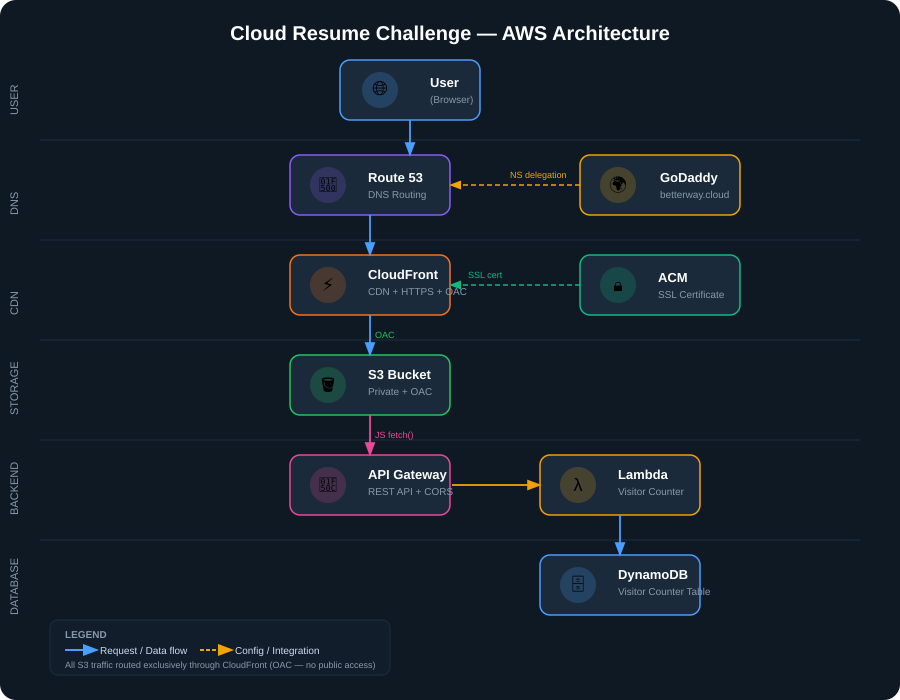

#  Cloud Resume Challenge — AWS 

## 📌 Overview
This project demonstrates a **real-world cloud architecture** by building and deploying a personal resume website using AWS services.

It follows a **secure, scalable, and serverless design**, integrating frontend hosting, backend APIs, and infrastructure best practices.

---

## 🧱 Architecture Diagram

> (Replace below image after creating in draw.io)



### 🔥 Architecture Flow

```
User (Browser)
↓
Route 53 (DNS)
↓
CloudFront (CDN + HTTPS)
↓
S3 Bucket (Private - OAC Enabled)
↓
Frontend (HTML, CSS, JS)
↓
API Gateway
↓
Lambda Function
↓
DynamoDB (Visitor Counter)
```
---

## Reusme Website


---

## ⚙️ Tech Stack

| Layer        | Services Used |
|-------------|--------------|
| Frontend     | HTML, CSS, JavaScript |
| Hosting      | Amazon S3 (Private) |
| CDN          | Amazon CloudFront (OAC) |
| Backend API  | API Gateway |
| Compute      | AWS Lambda |
| Database     | DynamoDB |
| DNS          | Route 53 |
| Domain       | GoDaddy (`betterway.cloud`) |

---

## 📚 Project Documentation

### 🔹 Frontend
- [Frontend Setup](./frontend/README.md)

### 🔹 Backend
- [API Gateway](./backend/API%20Gateway/README.md)
- [Lambda Function](./backend/Lambda/README.md)
- [DynamoDB](./backend/DynamoDB/README.md)

### 🔹 Infrastructure
- [CloudFront + OAC](./cloudfront/README.md)
- [Route 53 Custom Domain](./Route53/README.md)

---

## 🔐 Security Best Practices Implemented

- S3 bucket is **private (no public access)**
- Access controlled using **CloudFront Origin Access Control (OAC)**
- HTTPS enabled using **ACM SSL certificate**
- IAM roles follow **least privilege principle**

---

## 🚀 Deployment Flow (Step-by-Step)

1. Build frontend (HTML, CSS, JS)
2. Upload to S3 bucket (initial public testing)
3. Configure CloudFront (CDN + HTTPS)
4. Secure S3 using OAC (make private)
5. Create DynamoDB table (visitor counter)
6. Build Lambda function (update counter)
7. Expose API via API Gateway
8. Connect frontend → API
9. Configure Route 53 with custom domain

---

## ⚡ Key Features

- Fully serverless architecture
- Global content delivery using CloudFront
- Secure private S3 access (OAC)
- Dynamic visitor counter using Lambda + DynamoDB
- Custom domain with HTTPS

---

## 🧠 Lessons Learned / Challenges

- **CloudFront Caching Issue**  
  Updates to the website were not reflecting due to cached content.  
  **Solution:** Used CloudFront invalidation (`/*`) to refresh cached files.
<br>

- **OAC vs Public S3 Bucket Confusion**  
  Initially used public S3 static hosting, but later migrated to a secure setup.  
  **Learning:** CloudFront with **Origin Access Control (OAC)** is the correct production approach to keep S3 private.
<br>

- **Route 53 Nameserver Delay**  
  After updating nameservers in GoDaddy, the domain did not resolve immediately.  
  **Learning:** DNS propagation can take time (usually a few minutes to hours).
<br>

- **S3 Website Endpoint vs S3 Origin Endpoint**  
  Faced issues when switching from static hosting to private bucket.  
  **Learning:** CloudFront must use **S3 origin endpoint (not website endpoint)** when OAC is enabled.
<br>

- **CORS Issues with API Gateway**  
  Frontend was unable to fetch data initially.  
  **Solution:** Enabled proper CORS configuration in API Gateway.

---

## 💡 Key Learnings

- Real-world AWS architecture design
- Secure static website hosting
- Serverless backend integration
- DNS + CDN + HTTPS workflow

---


## 🏁 Conclusion

This project demonstrates the ability to design and deploy a **production-grade AWS architecture**, combining frontend, backend, and infrastructure with security and scalability best practices.
